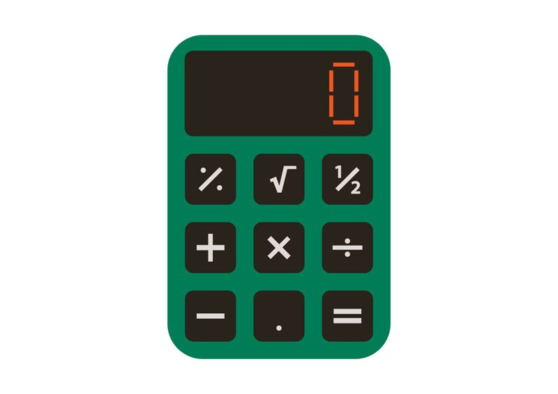

# Wage Calculator Script

## **What it does** 
 Calculates hourly wages for the week by taking a user input. The script will also account for overtime. :dollar:

---
## **Instructions**
   1. `How many hours? `  User will specify hours. 
   
   2. `What is your hourly rate? ` User will enter rate.
   
   3. `Your total wages = ${wages} ` User will receive their total wages pre-tax.

 ---

 ## **Error Catching**
 1. Any value less than 0 will cause the program to terminate :no_entry_sign:. 
