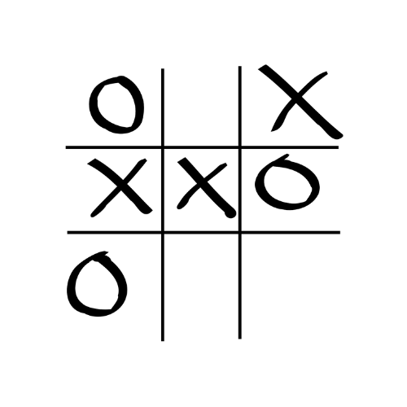

# Tic-Tac-Toe Game

## **What it does** 
 This program runs a simple of game of Tic-Tac-Toe where two users must play each other :boy: :girl:

 ##**How it runs**
 1. User will select a integer from 1-9. Each number corresponds with a specific position in the tic-tac-toe grid 
 
 2. The positions go from left-right, bottom-top, meaning "1" will refer to the first column, third row position and "2" will refer to the second column, third row position
 
 3. The program will prompt a response from "X" and "O", alternating between the two :x: :o:
 
 4. The program will determine if there was a tie or winner :smile:

---
## **Instructions**
   1. `What is your position? Player - X `  User "X" or "O" will specify choice
   
   2. Grid will be filled accordingly
   

 ---

 ## **Java Syntax Used**
 1. Classes :school:
 2. Built-in Java Packages :mailbox:
 3. Loops (Do-while, while) :loop:
 4. Conditional Statements :mag:
 5. Array :clipboard:
 6. Modular Programming (functions) :hammer:
