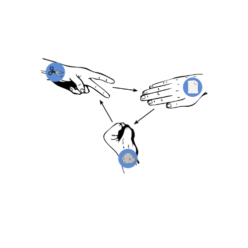

# Rock-Paper-Scissors Game

## **What it does** 
 This program runs a simple of game of Rock-Paper-Scissors :gem: :paperclip: :scissors:

 ##**How it runs**
 1. User will select "r", "p", or "s" to specify rock, paper, or scissors respectively
 
 2. The computer will select a random choice from a list of values containing "r", "p", or "s" :computer:
 
 3. The program will prompt the initial part of the game and will compare values between computer and user
 
 4. The program will determine if there was a tie, win, or loss smile:

---
## **Instructions**
   1. `Please choose r, p, or s for Rock, Paper, or Scissors... `  User will specify choice
   
   2. `READY, ROCK, PAPER, SCISSORS SHOOOT` Game is being staged
   

 ---

 ## **Python Syntax Used**
 1. Classes 
 2. Built-in Python Modules 
 3. Conditional Statements :mag:
 4. Lists :clipboard:
 5. Modular Programming (functions) :hammer:
